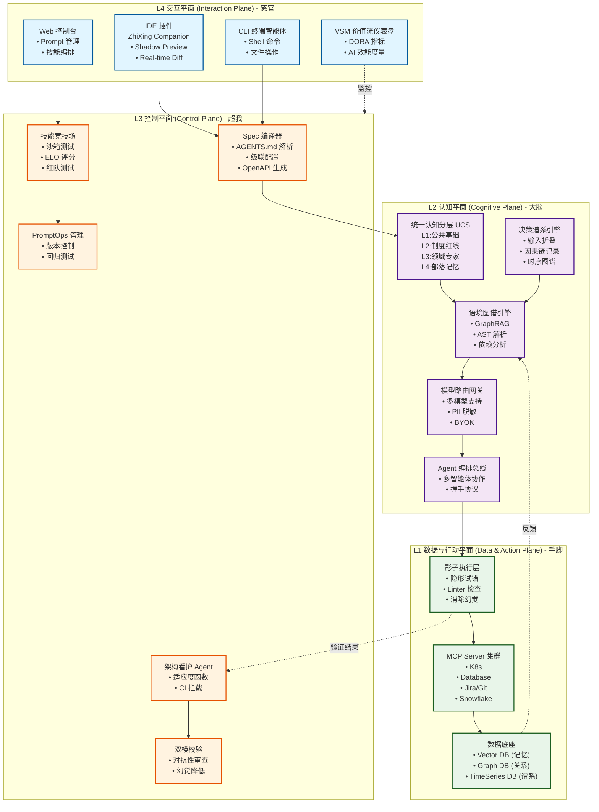
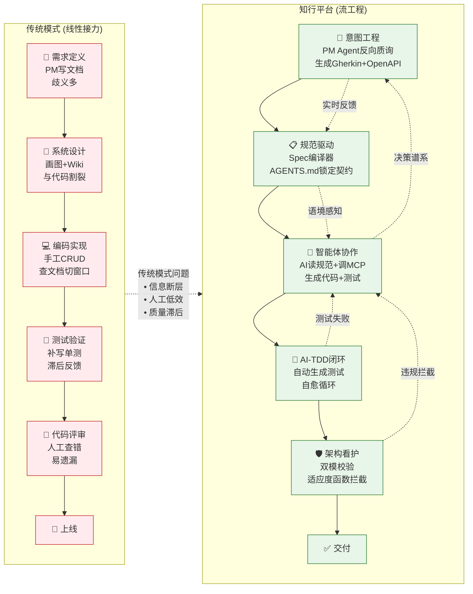
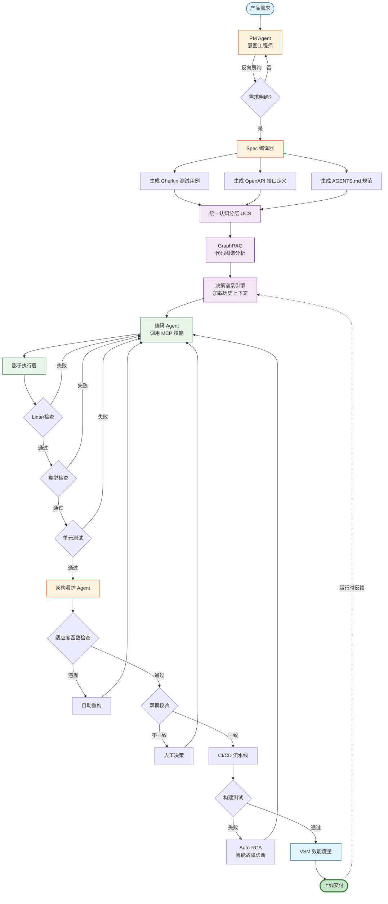

# 知行 (ZhiXing) · 智能研发认知操作平台

**ZhiXing CogniAction OS**

---

## 目录

1. [产品定位与核心理念](#产品定位与核心理念)
2. [战略背景与核心需求](#战略背景与核心需求)
3. [平台架构设计](#平台架构设计)
4. [核心功能模块](#核心功能模块)
5. [研发流程赋能](#研发流程赋能)
6. [实施路线图](#实施路线图)
7. [架构演进规划](#架构演进规划)

---

## 产品定位与核心理念

### 平台命名与品牌定义

在 AI 原生（AI-Native）时代，品牌不仅是名字，更是研发方法论的图腾。"知行"平台从传统的"辅助工具"向"认知操作系统"演进，重新定义人与 AI 的协作关系。

#### 中文全称：知行 · 智能研发认知操作平台

"知行"取自中国传统哲学"知行合一"，在 AI 软件工程语境下，它完美诠释了从静态知识检索到动态智能体执行的闭环。

**知 (Cognition/Knowing) - 从"代码检索"到"意图对齐"**

- **核心内涵**：不再是死板的文档或简单的向量检索，而是构建企业级认知平面（Cognitive Plane），解决研发中的"上下文贫困（Context Poverty）"和"认知断层"问题

- **技术支撑**：
  - **统一认知分层架构（UCS）**：将知识划分为 L1（公共基础）、L2（制度红线）、L3（领域专家）、L4（部落记忆）四层，解决"金鱼效应"
  - **GraphRAG 与代码感知**：通过图谱增强检索和 AST（抽象语法树）解析，构建代码依赖图谱，理解业务的"因果律"——不仅知道代码怎么写（Syntax），还通过关联架构决策记录（ADR）和历史上下文，深刻理解为什么这么写（Intent）
  - **意图驱动（Intent-Driven）**：研发的起点不再是编码，而是意图的结构化定义，将模糊的需求转化为机器可读的"意图"

**行 (Action/Doing) - 从"辅助建议"到"自主代理"**

- **核心内涵**：AI 角色从提供建议的 Copilot（副驾驶）进化为拥有代理权（Agency）的 Agent（智能体），成为能感知、推理、行动并自我修正的"数字员工"

- **技术支撑**：
  - **MCP（Model Context Protocol）**：基于模型上下文协议，打破工具孤岛，将企业内部的 Jira、K8s 控制台、数据库封装为 AI 可调用的"原子技能"
  - **流工程（Flow Engineering）**：通过"意图定义-上下文编排-AI生成-验证纠偏"的自动化闭环，让 Agent 自主完成从脚手架生成、代码编写到线上自愈的全过程
  - **CLI 智能体**：类似于 Claude Code，平台的"行"能力深入终端（Terminal），能够直接执行 Shell 命令、文件操作和环境部署

**合一 (Unity/Alignment) - 从"认知孤岛"到"数字化共生"**

- **核心内涵**：解决 AI 时代的"对齐"难题，确保 AI 的无限创造力被约束在企业的工程规范之内，实现**"规范即源码"（Spec-as-Source）**

- **技术支撑**：
  - **SDD（Spec-Driven Development）**：通过 AGENTS.md 和 OpenAPI 等规范文件，建立项目级的"宪法"，强制 AI 在既定轨道上运行，消除架构腐化
  - **架构适应度函数（Architectural Fitness Functions）**：在 CI 流水线中引入语义级检查，确保人类的架构设计（知）与 AI 的代码生成（行）在毫秒级达成一致
  - **人机回环（Human-in-the-Loop）**：强调人作为"策展人（Curator）"的角色，通过交互式评审与 AI 达成共识，而非被 AI 取代

#### 英文名称：ZhiXing CogniAction OS

- **CogniAction**：Cognition（认知）+ Action（行动），强调认知与行动的瞬时触发与无缝融合。在 AI 原生时代，思考（推理）与行动（工具调用）不再是割裂的步骤，而是像生物神经系统一样紧密耦合的反射弧

- **OS（Operating System）**：定义了平台的本质——它不是一个工具，而是研发组织的**"认知操作系统"**
  - **向下管理算力（Manage Compute）**：像传统 OS 管理 CPU 一样，通过 AI 网关统一纳管和路由底层大模型算力（OpenAI、Claude、DeepSeek 等），实现 BYOK（Bring Your Own Key）模式下的成本与安全控制
  - **向上支撑智能体（Support Agents）**：像传统 OS 支撑进程一样，为 AI Agents 提供运行时环境（Runtime）、记忆存储（Vector DB）和 I/O 接口（MCP），支撑智能体员工的高效协作

### 核心愿景

**"让意图即交付，让架构即护栏"**

- **意图即交付（Intent is Delivery）**：构建数字化的认知闭环，将模糊的商业意图通过 SDD 引擎和 Agent 执行层，直接转化为确定性的软件交付物，大幅缩短"想法到上线"的距离

- **架构即护栏（Architecture is Guardrails）**：控制 AI 时代的**"爆炸半径（Blast Radius）"**。通过将架构规范代码化、自动化，为 AI 的"随机性创造"构建坚固的安全边界，防止 AI 引入微妙的 Bug 或安全漏洞，实现工业级的确定性交付

---

## 战略背景与核心需求

### 核心痛点：语境鸿沟与工具碎片化

当前企业研发面临三大断层：

#### 1. 语境断层（Context Gap）

传统的记录系统（Jira/GitLab）只记录"结果"，丢失了"决策过程"。AI 无法理解"为什么这段代码要这样写"，导致生成的代码缺乏业务深度。

**决策谱系缺失**：企业最大的痛点是"决策谱系（Decision Traces）"的缺失。AI 知道代码是什么（State），但不知道为什么这么写（Causality）。例如，为什么这个 API 没有鉴权？是因为疏忽还是因为这是内部受信任服务？缺乏对 Slack 讨论、会议纪要与代码变更之间因果链条的捕获，导致 AI 在复杂决策时出现"时序盲区"。

#### 2. 能力断层（Capability Gap）

AI 工具（Copilot）主要解决微观编码，无法处理跨文件、跨系统的复杂任务（如"修复支付模块并更新文档"），缺乏对工具链的编排能力。

**技能质量不可控**：如果引入了低质量的技能，会造成 AI 的"能力腐化"。缺乏"影子工作区（Shadow Workspace）"机制，直接让 AI 操作代码库风险过高。

#### 3. 信任断层（Trust Gap）

AI 生成的代码容易产生幻觉或违反架构规范，缺乏自动化的"守夜人"机制进行治理。

**度量滞后问题**：缺乏对"AI 代码采纳率"、"流状态时间"等过程指标的实时监控，无法回答"引入 AI 后研发效能是否真的提升了"这一核心问题。

### 平台核心需求

1. **全域语境感知**：必须能够索引代码、文档、聊天记录（Slack/Teams）和运行时日志，构建完整的上下文图谱

2. **安全行动能力**：必须通过标准协议（MCP）安全地连接企业内部工具，实现读写操作的权限管控

3. **确定性交付**：必须通过 TDD（测试驱动开发）和 Spec（规范）约束，将 AI 的概率性输出转化为确定性的工程产物

4. **价值流度量**：建立 AI 时代的效能度量体系，证明 AI 的 ROI

---

## 平台架构设计

平台采用分层解耦、认知驱动的架构，自下而上分为四个核心平面：

### 整体架构视图

### 架构说明

上图展示了知行平台的四层架构体系，从下至上分别承担不同职责：

- **L1（手脚）**：负责数据存储与工具执行，通过影子执行层保证安全性
- **L2（大脑）**：处理推理、记忆与决策，构建企业级认知图谱
- **L3（超我）**：制定和执行规则，确保 AI 生成符合企业规范
- **L4（感官）**：提供人机交互触点，支持多种协作方式

数据流向：**L4 接收用户意图 → L3 编译规范 → L2 推理决策 → L1 执行动作 → 反馈回 L2/L3 验证**

---

### L1 数据与行动平面（Data & Action Plane）—— "手脚"

**定位**：数据的存储与工具的执行

**核心组件**：

#### 影子执行层（Shadow Execution Engine）

- 借鉴 Cursor 的 Shadow Workspace 技术
- **隐形试错**：AI 的所有代码修改首先在后台的"影子环境"中执行。只有当 Linter 通过、TypeScript 类型检查通过、相关测试通过后，才将差异（Diff）展示给人类开发者
- **消除幻觉**：作为 AI 与真实代码库之间的"气隙（Air Gap）"，拦截所有语法错误和低级幻觉

#### MCP Server 集群

- 封装数据库、K8s、Jira、Git、Snowflake 为标准 AI 技能接口
- 基于 MCP（Model Context Protocol）的技能虚拟化，企业内部团队（如运维、DBA）发布标准的 MCP 工具（如"查询生产日志"、"重置测试库"）
- 开发者一键订阅，Agent 即可获得该能力

#### 数据底座

- **Vector DB**：存储代码 AST、文档向量（记忆）
- **Graph DB**：存储实体关系与代码依赖图谱
- **TimeSeries DB**：记录时序数据，支持决策谱系追溯

---

### L2 认知平面（Cognitive Plane）—— "大脑"

**定位**：处理推理、记忆与决策

**核心组件**：

#### 统一认知分层（UCS）

将知识分为四层，解决"金鱼效应"：
- **L1 公共基础**：通用编程知识、框架文档
- **L2 制度红线**：企业安全规范、合规要求
- **L3 领域专家**：业务逻辑、领域模型
- **L4 部落记忆**：团队历史决策、代码演进记录

#### 决策谱系引擎（Decision Trace Engine）

构建超越代码的**时序上下文图谱（Temporal Context Graph）**：

- **输入折叠（Input Folding）**：实时摄取 Slack、Teams、Jira 和 Zoom 会议摘要，通过实体对齐（Entity Resolution）将"人"、"讨论"与"代码变更"关联起来

- **因果链记录**：当架构师在 Spec 中定义"允许绕过鉴权"时，引擎必须记录这一决策的来源（例如："基于 2025-10-01 的高管会议特批"），而非仅记录结果

- **价值**：当 AI 面对一段奇怪的代码时，它能回答"这是为了修复上个月的 500 错误而做的临时 Hack"，从而避免贸然重构导致的故障

#### 语境图谱引擎（Context Graph）

- 结合时序数据库与图数据库，记录决策谱系（Decision Traces），支持因果推理
- **代码感知型 RAG（GraphRAG）**：不只是切片文本，而是解析代码 AST（抽象语法树），构建函数级依赖图谱。当 AI 修改代码时，能感知上下游影响（Blast Radius）

#### 模型路由网关

- 基于任务难度路由至不同模型（DeepSeek/Claude/GPT）
- 实施 PII 脱敏
- 实现 BYOK（Bring Your Own Key）模式下的成本与安全控制

#### Agent 编排总线（Swarm Bus）

- 支持多智能体协作
- 定义 Agent 之间的握手协议（Handshake Protocol）
- 例如：产品 Agent 生成 Spec 后，必须显式"移交"给架构 Agent 进行审查，审核通过后才能"触发"编码 Agent

---

### L3 控制平面（Control Plane）—— "超我"

**定位**：规则的制定者与执行者，确保"知行合一"

**核心组件**：

#### Spec 编译器（Cascading Config）

- 解析 AGENTS.md、OpenAPI 和 PRD，生成 AI 可执行指令
- 支持级联配置：L1（公司级宪法）-> L2（团队级技术栈）-> L3（项目级例外）的继承与覆盖逻辑
- 在运行时将这三层规则合并为 AI 可理解的单一指令集

#### 技能竞技场（Skill Arena）

建立 AI 技能的准入与淘汰机制：

- **自动化沙箱（Sandbox Evaluation）**：任何新发布的 Prompt 或 MCP 工具，必须先在隔离沙箱中跑通标准测试集（如 SWE-bench Verified）

- **ELO 排位系统**：对同一任务（如"生成单元测试"）的多个 Prompt 版本进行 A/B 测试，根据开发者的采纳率计算 ELO 分，优胜劣汰

- **红队测试（Red Teaming）**：自动对 Prompt 进行注入攻击测试，防止 AI 被诱导泄露敏感信息

#### PromptOps 管理

- 像管理代码一样管理 Prompt
- 支持版本控制、自动化回归测试（Promptfoo），确保 Prompt 在模型升级后依然有效

#### 架构看护 Agent

- 基于适应度函数（Fitness Functions），拦截违反架构原则的代码提交
- 将自然语言的架构规则（如"Controller 层禁止直接调用 DAO"）转化为自动化检查脚本，在 CI 流水线中强制执行

#### 双模校验（Dual-Model Verification）

- 对于核心（如支付）模块，使用两个不同的大模型（如用 Claude 生成，用 GPT-4 审查）
- 形成"对抗性审查"，降低单一模型的幻觉风险

---

### L4 交互平面（Interaction Plane）—— "感官"

**定位**：人机协作的触点

**核心组件**：

#### IDE 插件（ZhiXing Companion）

- 集成 VS Code/Cursor
- 支持"影子工作区"预览，实时展示 AI 修改的差异

#### CLI 终端智能体

- 类似 Claude Code，遵循 Unix Philosophy
- 处理文件操作、Shell 命令和复杂重构

#### Web 控制台

- Prompt 管理
- 技能编排
- 效能看板

#### VSM 价值流仪表盘

引入 DORA + AI 新指标体系：
- **变更前置时间**：从 Idea 到代码的时间
- **AI 代码采纳率**：开发者接受 AI 生成代码的比例
- **流状态时间（Flow State Time）**：开发者处于深度工作状态的时间
- **架构腐化率**：违反架构规范的代码提交比例

---

## 核心功能模块

### 1. 认知核心：智能语境引擎（Intelligent Context Engine）

#### 代码感知型 RAG（GraphRAG）

- 不只是切片文本，而是解析代码 AST（抽象语法树），构建函数级依赖图谱
- 当 AI 修改代码时，能感知上下游影响（Blast Radius）

#### 活体文档（Living Documentation）

- 代码变更自动触发文档更新
- AI 分析 Diff，自动同步 API 文档和架构图，确保"代码即文档"

#### 决策谱系追溯

- 将 Slack 讨论、会议纪要、代码变更、Jira 工单串联起来
- 形成完整的因果链条，让 AI 理解"为什么"

---

### 2. 资产中心：AI 技能商店（Skill Store）

#### 基于 MCP 的技能虚拟化

- 企业内部团队（如运维、DBA）发布标准的 MCP 工具（如"查询生产日志"、"重置测试库"）
- 开发者一键订阅，Agent 即可获得该能力

#### 技能竞技场

- 对 Prompt 和 Agent 技能进行 A/B 测试和 ELO 评分
- 优胜劣汰，确保技能质量

---

### 3. 规范引擎：Spec 驱动开发（SDD）

#### AGENTS.md 协议

- 定义项目级的"宪法"
- 包含角色定义、技术栈限制、编码风格和工作流规则
- AI 启动时必须先读取此文件

#### 架构适应度检测

- 将自然语言的架构规则（如"Controller 层禁止直接调用 DAO"）转化为自动化检查脚本
- 在 CI 流水线中强制执行

---

### 4. 效能闭环：Agentic CI/CD

#### AI-TDD 循环

- 强制 AI 先写测试，再写代码
- 利用测试报错自动进入"生成-测试-修复"的自愈循环，直到测试通过

#### 智能故障诊断（Auto-RCA）

- 构建失败或生产告警时，Agent 自动拉取日志、定位代码变更、生成修复 Patch
- 人工只需点击合并

---

## 研发流程赋能

知行平台将研发流程从线性接力重构为**"流工程"（Flow Engineering）**。

### 核心变革总览：从"写代码"到"编排意图"

| 研发阶段 | 传统模式 (AS-IS) | 知行平台模式 (TO-BE) | 核心改变 |
|---------|----------------|---------------------|---------|
| 需求定义 | PM写文档，开发靠脑补，歧义多 | 意图工程：AI 辅助生成结构化 PRD 与测试用例 | 自然语言 → 机器指令 |
| 系统设计 | 画图、写Wiki，与代码割裂 | 规范驱动：生成 AGENTS.md 与 OpenAPI，契约即代码 | 文档 → 强约束规则 |
| 编码实现 | 人工编写 CRUD，查文档，切窗口 | 智能体协作：AI 读规范 → 调工具(MCP) → 生成代码 | 手工 → 编排与策展 |
| 测试验证 | 手写单测，人工回归，滞后反馈 | AI-TDD 闭环：AI 生成测试 → 跑通红绿循环 → 自动修复 | 验证后置 → 验证驱动 |
| 代码评审 | 查语法风格，人工看逻辑，易漏 | 架构看护：双模校验，架构适应度函数拦截违规 | 人眼查错 → 机器守门 |

### 研发流程对比图

### 知行平台流工程详细流程

### 流程说明

**传统模式 vs 知行平台核心差异：**

1. **需求阶段**：从"文档传递"到"意图对齐" - PM Agent 通过反向质询消除歧义
2. **设计阶段**：从"静态文档"到"可执行契约" - Spec 自动生成测试骨架和接口定义
3. **编码阶段**：从"人工堆砌"到"智能编排" - Agent 调用 MCP 技能,基于企业认知图谱生成代码
4. **测试阶段**：从"验证后置"到"验证驱动" - AI-TDD 自动生成测试并进入自愈循环
5. **评审阶段**：从"人眼查错"到"机器守门" - 架构看护 Agent 24小时实时拦截违规

**关键创新点：**
- **反馈闭环**：测试失败/违规拦截自动触发修复,形成自愈系统
- **语境感知**：决策谱系引擎提供完整的历史上下文,AI 理解"为什么"
- **安全保障**：影子执行层+双模校验+适应度函数三重防护,确保质量
- **效能度量**：VSM 实时监控 AI 代码采纳率、流状态时间等关键指标

---

### 各阶段详细赋能

#### 1. 需求与设计阶段：意图标准化（Intent Definition）

**传统痛点**：需求文档（PRD）模糊，含有大量"用户体验要好"等AI无法理解的形容词，导致AI生成代码时"幻觉"严重。

**知行平台支持**：

- **PM Agent（意图工程师）**：
  - 专门的对话机器人，不只是记录需求，还会"反向质询"PM，直到逻辑闭环
  - 强制将需求转化为 Gherkin 格式（Given-When-Then），这种格式既是文档，也是AI可以直接执行的测试骨架

- **Spec 编译器**：
  - 自动根据 PRD 生成 OpenAPI 接口定义和 Mermaid 流程图
  - 在写代码前先锁定接口契约

**具体用例：开发"跨境支付税费计算"功能**

- **传统流程**：PM说"要支持多国税率"。开发做的时候才发现没考虑汇率波动。

- **知行平台流程**：
  1. **输入**：PM告诉平台"要做多国税费计算"
  2. **反问**：平台 PM Agent 追问："汇率是实时获取还是按日结？保留几位小数？税表数据源在哪里？"
  3. **产出**：平台自动生成 `tax_calc.feature` 文件（测试用例）和 `openapi.yaml`（接口定义），明确规定输入输出字段。还没写代码，测试和接口就已经定死了。

**核心价值**：消除歧义，生成即对齐

---

#### 2. 编码实施阶段：上下文感知与行动（Context & Action）

**传统痛点**：AI 不知道企业内部的数据库结构、私有API和过往的"坑"，生成的代码往往无法运行（幻觉）。

**知行平台支持**：

- **统一认知分层（UCS）& GraphRAG**：
  - 通过代码图谱（GraphRAG）让 AI 理解"修改A处会影响B处"
  - AI 不再是瞎猜，而是基于企业代码全景图进行推理

- **MCP 技能商店（Action）**：
  - 封装内部工具（如"查询生产库Schema"、"查看K8s日志"）为 MCP 接口
  - AI 可以像人类一样调用这些工具来获取信息，而不是瞎编

**具体用例：修复"订单金额不一致"的 Bug**

- **传统流程**：开发者去 DB 查表结构，去 Wiki 搜计费逻辑，去 Git 翻历史提交记录，耗时 2 小时。

- **知行平台流程**：
  1. **指令**：开发者在 IDE 中 @知行Agent："修复订单 #9527 金额计算错误，参考财务计费规则。"
  2. **AI 行动（MCP）**：Agent 自动调用 Finance-MCP 工具读取最新的计费规则文档（认知层），连接数据库读取订单 #9527 的数据（数据层）
  3. **生成**：Agent 发现是最近一次汇率精度调整导致的，自动生成修复补丁，并附带对应的单元测试。开发者只需 Review 并点击"合并"

**核心价值**：释放算力，专注逻辑

---

#### 3. 构建与验证阶段：智能体闭环（Agentic Loop）

**传统痛点**：传统的 CI/CD 流水线是死的，报错了只能发邮件给原本就忙碌的开发者，等待人工修复。

**知行平台支持**：

- **AI-TDD（测试驱动开发）**：
  - 强制 AI 先写测试再写代码
  - 如果测试不通过，AI 会读取报错日志 -> 分析原因 -> 修改代码 -> 重试，进入**"自愈循环"**，直到测试通过

- **智能故障诊断（Auto-RCA）**：
  - 当构建失败时，平台自动分析日志，定位是哪一行代码引起的，并生成修复 Patch

**具体用例：提交代码后 CI 构建失败**

- **传统流程**：收到报警邮件 → 停下手头工作 → 看日志 → 发现是引入的第三方库版本冲突 → 修改 package.json → 重新提交。

- **知行平台流程**：
  1. **触发**：流水线检测到构建失败
  2. **自愈**：平台的 Build Agent 自动介入，分析日志发现是 lodash 版本冲突
  3. **行动**：Agent 自动尝试升级版本并运行测试，发现兼容性问题解决，测试通过
  4. **结果**：开发者收到通知："构建曾失败，但知行 Agent 已通过升级依赖自动修复，请确认合并。"

**核心价值**：质量内建，自动化闭环

---

#### 4. 治理与风控阶段：架构看护（Governance）

**传统痛点**：AI 写代码太快，容易引入不符合架构规范的"烂代码"（例如 Controller 层直接调 DB），导致架构腐化。

**知行平台支持**：

- **架构适应度函数（Fitness Functions）**：
  - 将架构规则代码化（如"禁止循环依赖"、"禁止直接调用私有API"）
  - AI 提交代码时，如果违反这些规则，会被直接拦截

- **双模校验（Dual-Model Verification）**：
  - 对于核心（如支付）模块，使用两个不同的大模型（如用 Claude 生成，用 GPT-4 审查）
  - 形成"对抗性审查"，降低单一模型的幻觉风险

**具体用例：初级开发者使用 AI 生成了一个"用户查询"接口**

- **传统流程**：代码跑通了，上线了。半年后发现这个接口绕过了权限层直接查库，导致数据泄露风险。

- **知行平台流程**：
  1. **生成**：AI 快速生成了代码
  2. **拦截**：在提交时，平台的**"守夜人 Agent"** 触发报警："检测到 UserService 直接引入了 SqlDriver，违反分层架构原则（Layer 2 制度知识）。"
  3. **纠正**：Agent 自动重构代码，改为调用标准的 DataAccessLayer 接口，并提示开发者通过架构审查

**核心价值**：机器守门，合规安全

---

### 价值主张总结

从流程上看，知行平台不仅仅是一个提效工具，它是一个**"有记忆、懂规矩、能干活"**的数字合伙人：

1. **事前**：它像资深架构师一样帮你定规矩（Spec/PRD）
2. **事中**：它像全栈工程师一样帮你调资源（MCP）和写代码
3. **事后**：它像严格的 QA 和运维一样帮你兜底（Auto-RCA/架构看护）

这正是 DORA 报告中提到的从"个人效能"向"组织效能"转型的关键——**让系统承载认知，让 AI 执行规范**。

---

## 实施路线图

### 阶段一：筑基（Infrastructure）

**目标**：建立基础设施和开发环境

**核心任务**：
1. 部署 AI 网关（LiteLLM）与 PII 脱敏引擎
2. 统一 IDE 插件（Cursor/VSCode），配置基础 AGENTS.md 模板
3. 搭建影子执行环境（Shadow Workspace）
4. 建立基础数据底座（Vector DB + Graph DB + TimeSeries DB）

**交付物**：
- AI 网关上线，支持 BYOK
- IDE 插件可用，支持基础代码生成
- 影子环境可用，支持安全测试

---

### 阶段二：连接（Connection）

**目标**：打通企业内部工具链，构建认知图谱

**核心任务**：
1. 发布内部 MCP Server（GitLab、Jira、DB、K8s）
2. 构建基础语境图谱，索引核心代码库与文档
3. 建立决策谱系引擎，开始记录代码变更与讨论的关联
4. 上线基础的 Spec 编译器，支持 AGENTS.md 解析

**交付物**：
- 至少 5 个核心 MCP 工具上线
- 核心代码库完成索引
- 决策谱系开始记录

---

### 阶段三：进化（Evolution）

**目标**：建立完整的 AI 原生研发体系

**核心任务**：
1. 全员推广 TDD 与 Spec-Driven 开发模式
2. 上线 Skill Arena，建立内部 AI 技能生态与人才画像
3. 部署架构适应度函数，强制架构治理
4. 上线 VSM 价值流仪表盘，度量 AI 效能
5. 支持多智能体协作（Agent Bus）

**交付物**：
- TDD 覆盖率达到 80%+
- Skill Arena 有至少 20 个技能在竞技
- 架构看护拦截率 > 90%
- VSM 仪表盘实时更新

---

## 架构演进规划

### 从 v1.0 到 v2.0 的关键升级

| 维度 | v1.0 现状 | v2.0 升级 | 核心价值 |
|-----|----------|----------|---------|
| **认知深度** | 代码图谱 + 静态文档 | **决策谱系引擎**：关联 Slack/Jira/代码变更 | AI 理解"为什么"，而非仅"是什么" |
| **行动质量** | MCP 技能商店 | **技能竞技场 + 影子执行**：ELO 评分 + 安全沙箱 | 确保技能质量，降低操作风险 |
| **治理能力** | 架构看护（拦截） | **双模校验 + 级联配置**：对抗性审查 + 多层规则 | 降低单一模型风险，适应组织复杂性 |
| **效能度量** | 无 | **VSM 仪表盘**：DORA + AI 新指标 | 证明 AI 的 ROI，持续优化 |

---

### 未来扩展能力

#### 1. 支持"级联配置"（Cascading Specs）

**挑战**：随着团队扩大，单一的 AGENTS.md 会变得臃肿且冲突。

**解决方案**：
- 在 L3 控制平面引入 Spec 编译器
- 支持 L1（公司级宪法）-> L2（团队级技术栈）-> L3（项目级例外）的继承与覆盖逻辑
- 编译器在运行时将这三层规则合并为 AI 可理解的单一指令集

---

#### 2. 从"单体智能"到"蜂群编排"（Swarm Orchestration）

**挑战**：未来任务将由一组专精 Agent（如：一个写 SQL，一个写前端，一个做安全审计）协作完成。

**解决方案**：
- 在 L2 认知平面增加 Agent 编排总线（Agent Bus）
- 定义 Agent 之间的握手协议（Handshake Protocol）
- 例如：产品 Agent 生成 Spec 后，必须显式"移交"给架构 Agent 进行审查，审核通过后才能"触发"编码 Agent

---

#### 3. 价值流反馈闭环（VSM Loop）

**挑战**：需要证明 AI 的 ROI。

**解决方案**：
- 在 L4 交互平面增加价值流仪表盘
- 引入 DORA + AI 新指标体系：
  - **变更前置时间**：从 Idea 到代码的时间
  - **AI 代码采纳率**：开发者接受 AI 生成代码的比例
  - **流状态时间（Flow State Time）**：开发者处于深度工作状态的时间
  - **架构腐化率**：违反架构规范的代码提交比例

---

## 总结

**知行 v2.0 不仅是一套工具，更是企业在 AI 时代"认知（Know）"与"行动（Do）"的数字化中枢。**

它通过：
- **规范确立秩序**（Spec-Driven Development）
- **语境赋予智慧**（Decision Traces + GraphRAG）
- **代理执行任务**（MCP + Agentic Flow）
- **度量证明价值**（VSM + DORA Metrics）

最终实现研发效能的指数级跃迁，从"AI 辅助编程"进化为"AI 原生研发"。

通过引入**决策谱系（Context）**、**技能竞技场（Evaluation）** 和 **影子执行（Safety）**，知行平台从一个优秀的 AI 辅助工具集升级为真正的**企业级认知操作系统**，不仅解决了"AI 怎么写代码"的问题，更解决了"AI 为什么这么写"以及"如何放心让 AI 写"的深层工程挑战。
